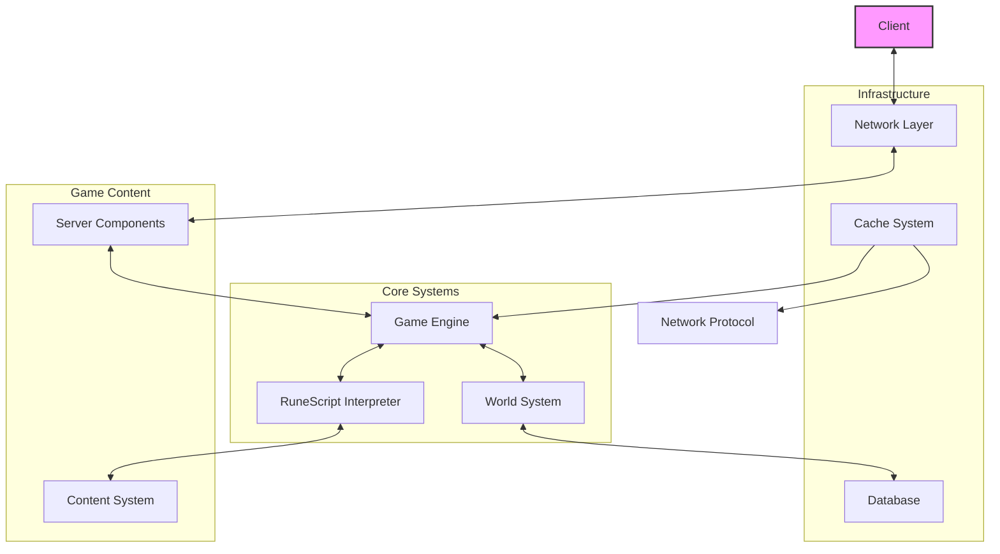
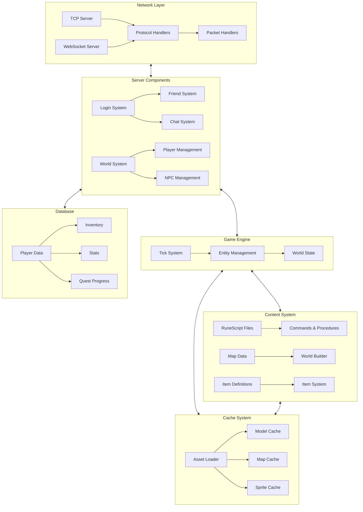
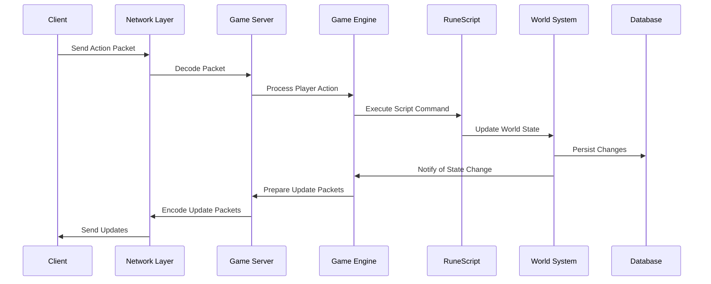
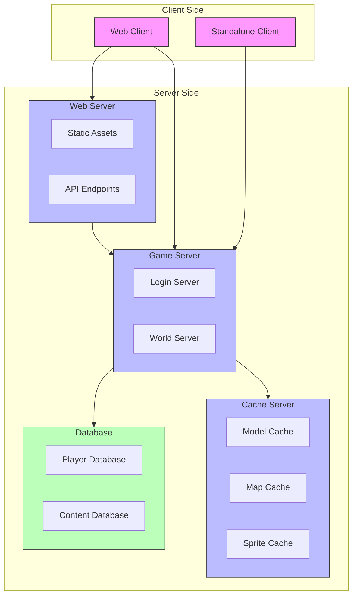

# Architecture Overview

This document provides a high-level overview of the Lost City Server architecture, illustrating how different components interact to create a complete RuneScape 2 emulation system.

## System Architecture

The Lost City Server is built using a modular architecture that separates concerns and allows different components to evolve independently. The diagram below shows the main systems and their relationships:

## Component Relationships

The server consists of several key components that work together:

## Data Flow

This diagram shows how data flows through the system when a player performs an action:

## Deployment Architecture

The server can be deployed in different configurations depending on requirements:

## Technical Stack

The Lost City Server is built using the following technologies:

| Component | Technology |
|-----------|------------|
| Server Runtime | Node.js |
| Language | TypeScript |
| Database | Prisma ORM with PostgreSQL |
| Network | WebSockets and TCP sockets |
| HTTP Server | Express.js |
| Testing | Vitest |
| Build System | npm/pnpm |
| Content Parsing | Custom RuneScript interpreter |
| Caching | In-memory caching with file system persistence |

## Next Steps

Detailed documentation for each component will be provided in the following sections:
- [Component Details](./components.md)
- [Data Flow](./data-flow.md)
- [Deployment Architecture](./deployment.md) 