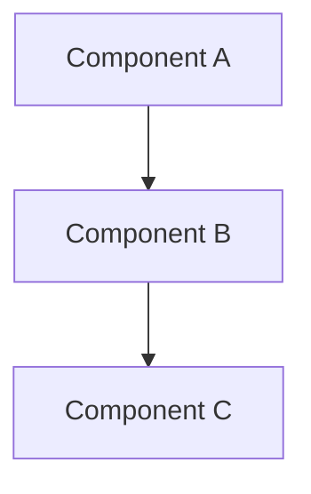

# Documentation Style Guide

This guide outlines the documentation standards for the project. Following these guidelines ensures consistency across all documentation and makes it easier for contributors to understand and use the codebase.

## Writing Style

### Voice and Tone
- Use clear, concise language
- Write in present tense
- Use active voice when possible
- Address the reader directly using "you"
- Assume a technical audience but avoid unnecessary jargon

### Formatting Conventions
- Use sentence case for headings (capitalize only the first word and proper nouns)
- Use numbered lists for sequential steps
- Use bullet points for related but non-sequential items
- Wrap code snippets in appropriate markdown fences (```typescript, ```javascript, etc.)
- Add syntax highlighting to code blocks where appropriate

## Code Documentation

### TypeScript/JavaScript Comments
- Use JSDoc format for TypeScript/JavaScript code
- Document all public APIs, classes, interfaces, and methods
- Include parameter descriptions, return values, and examples
- Explain complex algorithms and design decisions
- Format:
  ```typescript
  /**
   * Brief description of what the function does
   * 
   * @param paramName Description of the parameter
   * @returns Description of the return value
   * @throws Conditions under which an error is thrown
   * @example
   * // Example usage
   * const result = myFunction('example');
   */
  ```

### RuneScript Comments
- Place documentation comments directly above commands and procedures
- Document all parameters and their expected values
- Include example usage where helpful
- Format:
  ```
  // [procedure_name]: Brief description of what this procedure does
  // param1: Description of parameter 1
  // param2: Description of parameter 2
  // returns: Description of what the procedure returns
  [proc,procedure_name](param1, param2)
  ```

## Architecture Documentation

### Diagrams
- Use Mermaid.js for diagrams
- Include both high-level and detailed views as appropriate
- Use consistent shapes, colors, and naming conventions
- Include a text description to accompany each diagram
- Format:



### Component Documentation Template
Each component should include:
1. Purpose and responsibilities
2. Interactions with other components
3. Key classes and interfaces
4. Configuration options
5. Examples of usage

## Document Types and Templates

### Concept Documentation
For explaining broad concepts or systems:

```md
# [Concept Name]

## Overview
Brief description of the concept and its importance.

## Key Components
* Component 1: Description
* Component 2: Description

## How It Works
Detailed explanation with diagrams if appropriate.

## Best Practices
Guidelines for using this concept effectively.

## Examples
Code examples showing the concept in action.
```

### API Reference
For documenting specific APIs:

```md
# [API Name]

## Introduction
Brief description of the API's purpose.

## Methods
### method1(param1, param2)
Description of what the method does.
- `param1`: Type and description
- `param2`: Type and description
- Returns: Return type and description

### method2(param1)
...

## Usage Examples
Code snippets showing how to use the API.

## Error Handling
Common errors and how to handle them.
```

## Maintenance and Updates

- Review documentation when corresponding code changes
- Update examples to reflect current best practices
- Clearly mark deprecated features
- Version documentation alongside code releases

## SEO Considerations

- Use descriptive, keyword-rich titles
- Include relevant keywords naturally in the content
- Provide complete information to minimize the need for external searches
- Use links to connect related concepts for better navigation 